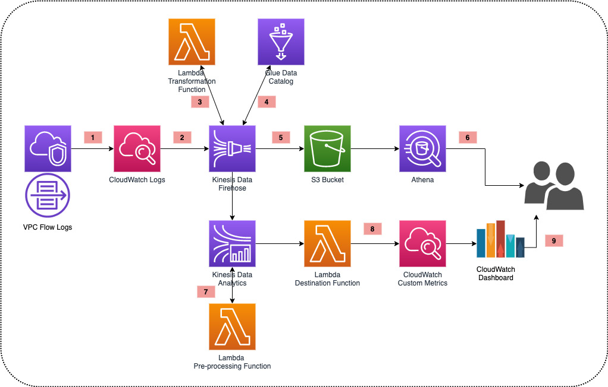

# Introduction 
 This code repository contains scripts and configuration files to implement a VPC flow log analysis solution.

# Architecture

# Deployment Process
1.  Install runway
2.  In setup\environments\config.yml, enter the account ID, AWS region, and VPC ID to create visualization flows for.
3.  Change working directory to setup\environments\${environment}
4.  Run 'runway deploy --tag "enabled"'
5.  Browse to the CloudFormation console to view progress; after stack finishes creating, browse to the Athena console.
6.  Select the VPC database and configure the query-results folder location (create this in the VPC bucket).
